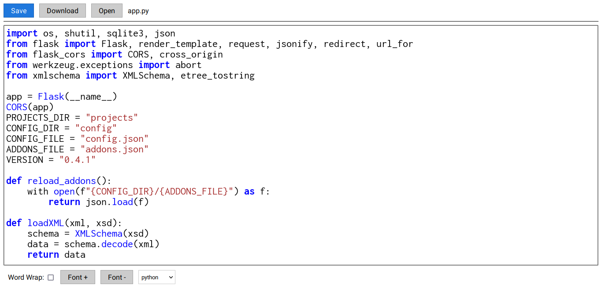

<div align="center">
  
  <h1>More Points</h1>
  <p>Free and open source file explorer written in Python and Flask</p>
</div>
<hr>

[](https://www.gnu.org/licenses/gpl-3.0.en.html)
[](https://ko-fi.com/adrbog)

The initial idea was to create a free alternative to Microsoft's Sharepoint. But I think this project can be more than just a Sharepoint clone.

Use MorePoints to navigate through the file system from your browser. 
Supports local browse and multiple protocols (FTP, SFTP (SSH), soon WebDav). 
You can also edit files with the integrated code editor.

## Installation

```bash
git clone https://github.com/AdrBog/MorePoints.git
cd MorePoints
make setup
make run
```

In your web browser, go to <a href="localhost:5002">localhost:5002</a> and the application should run correctly.

## Screenshots

<details>
<p align="center">

<br>

<br>

<br>

</p>
</details>

## Features
<dl>
    <dt>Support for multiple protocols:</dt>
    <dd>
    	<ul>
    		<li>FTP</li>
    		<li>SFTP (SSH)</li>
    		<li>WebDav (Under Development)</li>
    		<li>Or just local</li>
		</ul>
    </dd>
    <dt>Built-in code editor</dt>
    <dd>More Points comes integrated with my own <a href="https://github.com/AdrBog/MiniCodeEditor">code editor</a> </dd>
    <dt>Legacy mode</dt>
    <dd>Configure a point in legacy mode too support "old" browsers, like Pale Moon.</dd>
</dl>

## Documentation

You can access the MorePoints documentation by running:
```sh
make doc
```
Then go to <a href="localhost:8080">localhost:8080</a> in your browser

## License

More Points

Free and open source file explorer written in Python and Flask.

Copyright (C) 2024 Adrian Bogdan

This program is free software: you can redistribute it and/or modify
it under the terms of the GNU General Public License as published by
the Free Software Foundation, either version 3 of the License, or
(at your option) any later version.

This program is distributed in the hope that it will be useful,
but WITHOUT ANY WARRANTY; without even the implied warranty of
MERCHANTABILITY or FITNESS FOR A PARTICULAR PURPOSE.  See the
GNU General Public License for more details.

You should have received a copy of the GNU General Public License
along with this program.  If not, see <https://www.gnu.org/licenses/>.
