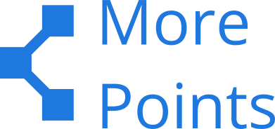
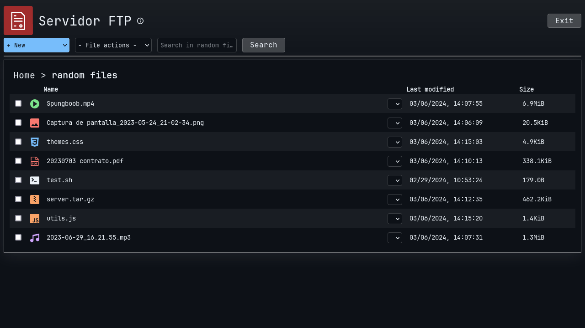
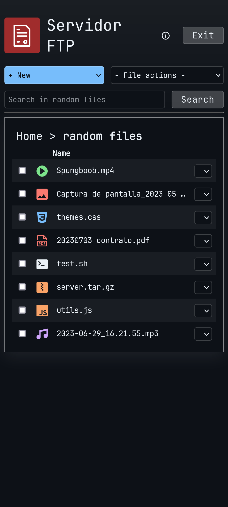

<div align="center">
  
  <h1>More Points</h1>
  <p>Lightweight Free and Open Source alternative to Microsoft's SharePoint written in Python and Flask.</p>
</div>
<hr>

[](https://www.gnu.org/licenses/gpl-3.0.en.html)
[](https://ko-fi.com/adrbog)

This application works as a FTP server, where instead of a user, you configure **sites**, which can be accessed by people in your company/home for secure document sharing within the company intranet.

The purpose of this project is to offer a free alternative for households or small businesses.

Needless to say, this application should not be accessible from the Internet, only from within the local network.

## Disclaimer
USE AT YOUR OWN RISK. CURRENTLY IN ALPHA. MAKE SURE YOU KEEP A BACKUP OF ALL DATA ELSE WHERE

## Installation

```bash
git clone https://github.com/AdrBog/MorePoints.git
cd MorePoints
python -m venv venv
source venv/bin/activate
pip install flask flask-cors pyftpdlib
```

## Setup

First run **server.py** to start the FTP server containing the sites.
```bash
sudo python server.py
```
Then run the flask application
```bash
python -m flask run -p 5002
```
In your web browser, go to <a href="localhost:5002">localhost:5002</a> and the application should run correctly.

## Screenshots

<details>
<p align="center">

<br>

<br>

</p>
</details>

## License

More Points

Lightweight Free and Open Source alternative to Microsoft's SharePoint written in Python and Flask.

Copyright (C) 2024 Adrian Bogdan

This program is free software: you can redistribute it and/or modify
it under the terms of the GNU General Public License as published by
the Free Software Foundation, either version 3 of the License, or
(at your option) any later version.

This program is distributed in the hope that it will be useful,
but WITHOUT ANY WARRANTY; without even the implied warranty of
MERCHANTABILITY or FITNESS FOR A PARTICULAR PURPOSE.  See the
GNU General Public License for more details.

You should have received a copy of the GNU General Public License
along with this program.  If not, see <https://www.gnu.org/licenses/>.
