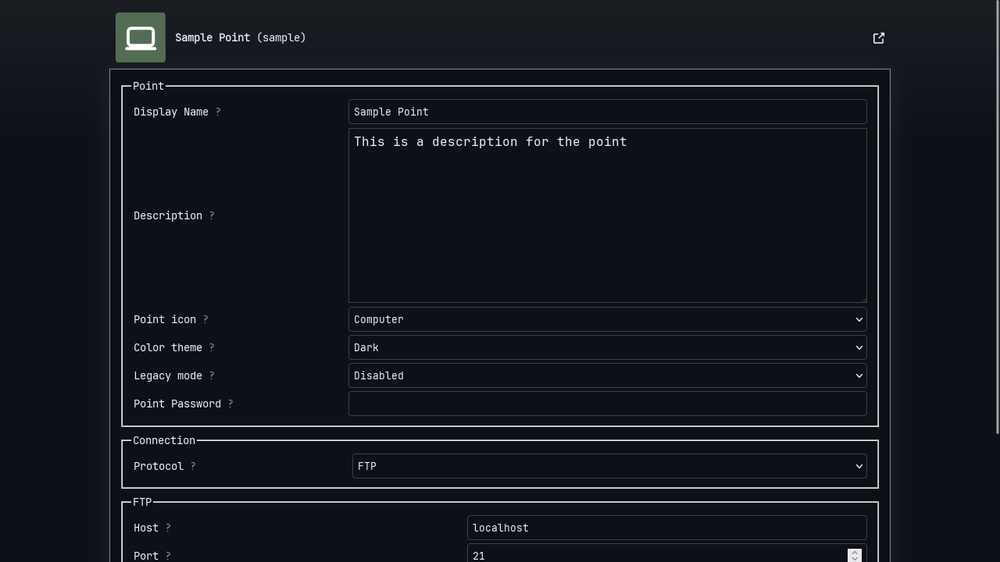
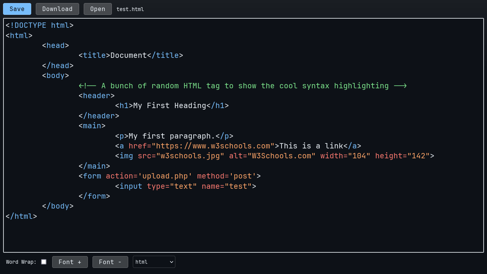

<div align="center">
  
  <h1>More Points</h1>
  <p>Free and Open Source FTP client and self-hosted FTP server written in Python and Flask.</p>
</div>
<hr>

[](https://www.gnu.org/licenses/gpl-3.0.en.html)
[](https://ko-fi.com/adrbog)

The initial idea was to create a free alternative to Microsoft's Sharepoint. But I think this project can be more than just a Sharepoint clone.

This application works as a self-hosted FTP server/client, Where you create **point** to connect to the FTP server, from there you can quickly create/edit/upload/delete files.

My goal is to offer a free alternative for households or small businesses to share files.

Needless to say, this application should not be accessible from the Internet, only from within the local network.

## Installation

```bash
git clone https://github.com/AdrBog/MorePoints.git
cd MorePoints
python -m venv venv
source venv/bin/activate
pip install flask flask-cors pyftpdlib
```

## Setup

If you don't have any FTP server configured, don't worry, More Points comes bundled with an FTP server, run **server.py**:
```bash
sudo python server.py
```
Then run the flask application
```bash
python -m flask run -p 5002
```
In your web browser, go to <a href="localhost:5002">localhost:5002</a> and the application should run correctly.

## Screenshots

<details>
<p align="center">

<br>

<br>

<br>

</p>
</details>

## Features
<dl>
    <dt>FTP server</dt>
    <dd><b>server.py</b> is your own FTP server in case you don't have any created. <br><b>server_ssl.py</b> is the same server but with SSL support</dd>
    <dt>FTP client</dt>
    <dd>More Points can also connect to external FTP servers.</dd>
    <dt>Built-in code editor</dt>
    <dd>More Points comes integrated with my own <a href="https://github.com/AdrBog/MiniCodeEditor">code editor</a> </dd>
    <dt>Legacy mode</dt>
    <dd>Configure a point in legacy mode too support "old" browsers, like Pale Moon.</dd>
    <dt>TLS/SLL support</dt>
    <dd>Use FTP over explicit TLS/SSL. Most of the time it fails but for <b>server_ftp.py</b> it works.</dd>
</dl>


## License

More Points

Free and Open Source FTP client and self-hosted FTP server written in Python and Flask.

Copyright (C) 2024 Adrian Bogdan

This program is free software: you can redistribute it and/or modify
it under the terms of the GNU General Public License as published by
the Free Software Foundation, either version 3 of the License, or
(at your option) any later version.

This program is distributed in the hope that it will be useful,
but WITHOUT ANY WARRANTY; without even the implied warranty of
MERCHANTABILITY or FITNESS FOR A PARTICULAR PURPOSE.  See the
GNU General Public License for more details.

You should have received a copy of the GNU General Public License
along with this program.  If not, see <https://www.gnu.org/licenses/>.
